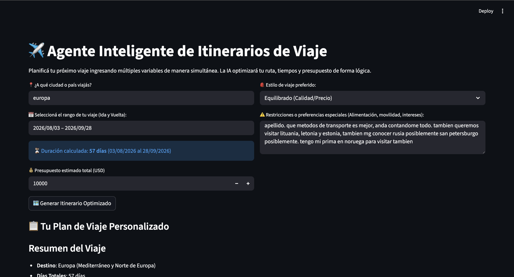
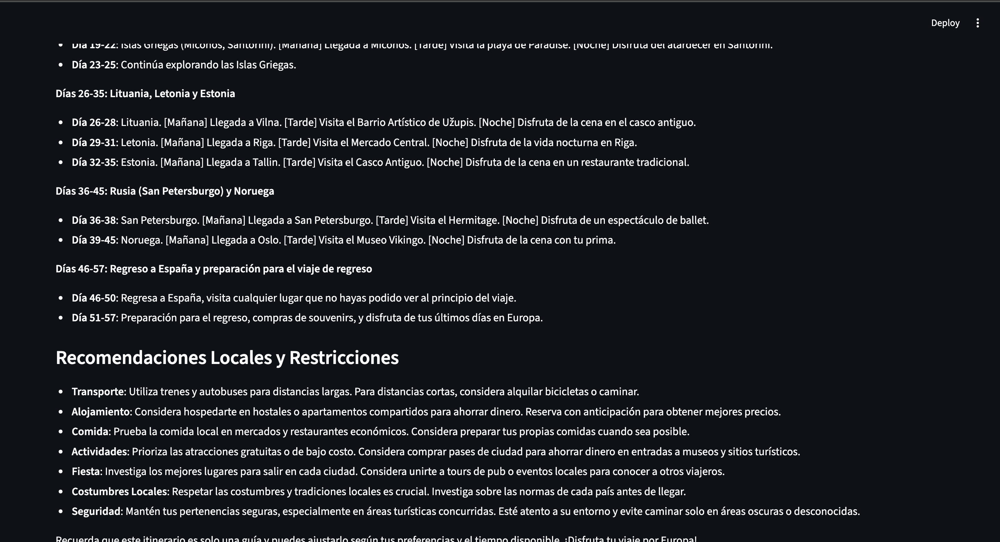

## 📸 Evidencia de Funcionamiento & UI

A continuación se detalla el flujo de ejecución de la aplicación, ilustrando la captura de variables concurrentes mediante el selector de calendario y el procesamiento estructurado final del Agente de Viajes:

### 1️⃣ Entrada Multi-Variable y Rango de Fechas Dinámico
En esta sección el usuario define el destino, presupuesto y restricciones. El componente de calendario calcula de forma automática la cantidad exacta de días para el itinerario, eliminando límites estáticos en la interfaz de usuario.

### 2️⃣ Itinerario Optimizado y Distribución Financiera
Informe final generado por **Llama 3.3 70B**. Se aprecia la construcción de la matriz de costos en formato de tabla y la secuenciación del viaje dividida estrictamente por bloques de tiempo (Mañana, Tarde y Noche).

